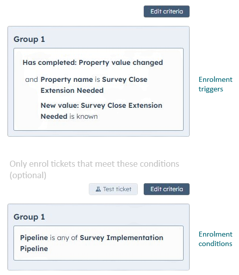

### Benefits of using both enrolment triggers and conditions

- Complicated criteria can be split into two stages, resulting in logic that is easier to read and modify later
- It is often easier to duplicate/adapt workflows based on fairly broad triggers with specific conditions
- For workflows that allow re-enrolment, splitting the eligibility logic often simplifies complex re-enrolment criteria

### Enrolment on creation
Note that a record created may immediately enter a workflow that triggers on <u>property value change</u> if its property is set accordingly.
> Example: A task created with its *priority* set to <u>high</u> will immediately enrol in a task workflow that triggers on <u>property value change</u> where *priority* = <u>high</u>, even though its *priority* has arguably not 'changed'.  

### Re-enrolment complications

1. <u>Record meets filter criteria</u>  
If any of the criteria involve *associated properties*, re-enrolment will not work properly.  
<small>Use <u>Property change</u> on native properties and restrict <i>associated properties</i> to enrolment conditions.</small>  
2. <i>'Child' enrolment</i>  
HubSpot will give a warning in any workflow that creates a record of the same type (e.g. if a ticket workflow creates a new ticket), but the workflow will run. However, if the new ticket enters the workflow that created it and tries to create a ticket, the workflow will fail.  
<small>Workaround: Call a different workflow to create the new record</small> 

### 'Mass enrolment' on associated objects using workflow triggers 
If the trigger for the enrolment is a property (or task *priority*, etc.) that should be cleared, ensure that enrolment criteria allow all affected records to enter the workflow.  
> <small>Example  
> A deal workflow sets <u>Force Comms update</u> to a trigger property on all associated tickets, causing them to enrol in a ticket workflow. Only tickets with active comms are relevant. However, it is good practice NOT to exclude unwanted tickets from entering the workflow; rather, all tickets should enrol so that the trigger property is always cleared before deciding whether the ticket should be acted upon.</small>

#### See further: [Using property triggers/flags](../articles/Article-How-to-circumvent-HubSpots-limitations.md#using-property-triggersflags)